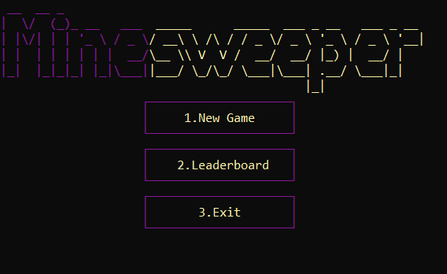
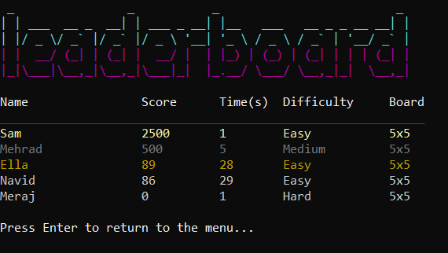
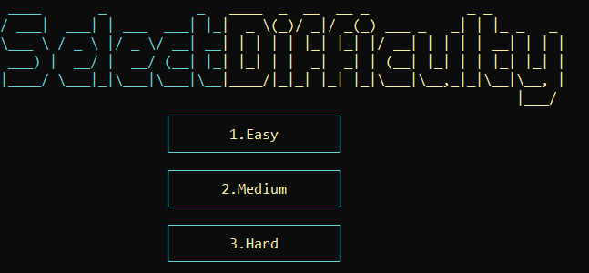
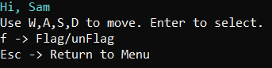
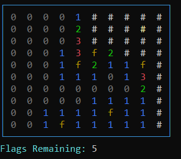

# Minesweeper (Console Edition)


This project is a minimal clone of the popular **Minesweeper** game🕹️. This implementation brings a modern, responsive UI to the terminal with features like difficulty settings, scoring, a dynamic leaderboard, and more.

---

## 🎮 Features

- 🎯 **Custom Board Size:** Choose your desired grid dimensions before each game.
- ⚙️ **Three Difficulty Levels:** Easy, Medium, and Hard — each scales the number of bombs and affects the score.
- ⏱ **Score System:** Points are calculated based on time taken, board size, and difficulty.
- 🚩 **Mine Flagging:** Flag suspected mines and track the remaining number of bombs.
- 🕒 **Game Timer:** Displays total time spent when the game ends.
- 🎨 **Colorful Terminal UI:** Fast, clean, and intuitive navigation using `W`, `A`, `S`, `D`, and `Enter`.
- 🏆 **Leaderboard:** Automatically sorted by score, shows top performers and their stats.
- 💾 **Persistent Save:** Stores player stats in `leaderboard.txt` for future sessions.

---

## 📷 Game View

### 🧩 Main Menu



---

### 🥇 Leaderboard (Sorted by Score)



---

### ⚙️ Difficulty Selection



---

### 🎮 Controls Guide



---

### 🧱 In-Game UI (Flagging & Bomb Count)



---

## ⚙️ How to Set Up and Run

### ✅ Prerequisites

- A C++ compiler (e.g., g++, MSVC)
- Windows or Linux terminal with ANSI escape code support

### 📦 Build & Run

#### On Windows:

```bash
g++ -o minesweeper Minesweeper.cpp
minesweeper.exe
```

#### On Linux/macOS:

```bash
g++ -o minesweeper Minesweeper.cpp
./minesweeper
```

> ⚠️ On Windows, ensure your terminal supports UTF-8 (e.g., Windows Terminal or PowerShell with `chcp 65001`).

---

## 🕹️ How to Play

- Navigate the board using:
  - `W` – Move Up
  - `A` – Move Left
  - `S` – Move Down
  - `D` – Move Right
- Press `Enter` to reveal a cell.
- Press `F` to flag or unflag a cell.
- Press `Esc` to return to the main menu.

💡 Win the game by uncovering all non-bomb cells!

---

## 📁 Files

- `Minesweeper.cpp` – Main source code
- `leaderboard.txt` – Automatically generated leaderboard (created after first play)

---

## 👤 Creator

> **Creator:** _Meraj Dreafshi_  
> **Contact:** _meraj.derafshi@gmail.com_
> **Github:** _https://github.com/MerajDerafshi_


---

## 📜 License

This project is open-source and free to use for learning or improvements. Attribution is appreciated.
